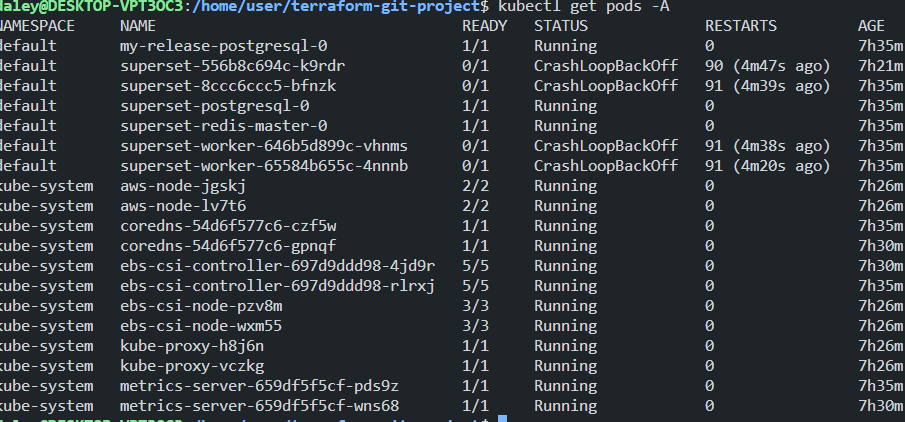

# Data Platform SRE Engineer - Take Home Assessment

## Project Overview

This project aims to demonstrate the setup of a data platform using AWS services and infrastructure as code via Terraform. It includes the deployment of Superset for data visualization, an S3 bucket for data storage with KMS encryption, and IAM roles for specific permissions.

## Infrastructure Setup

## Terraform  Configuration

### S3 Bucket with KMS Encryption:

An S3 bucket is defined with KMS encryption to store the CSV dataset securely.

### IAM Role for Athena:

An IAM role is created with permissions to access Athena and the S3 bucket. This facilitates querying the dataset using Athena.

### AWS Access Key for IAM Role:
The configuration includes the creation of an AWS access key that can assume the IAM role.

## Superset Deployment

### Orchestration Platform:

Superset is deployed using Helm on [Your Orchestration Platform].

### Issues Encountered:

During the deployment, initialization, and worker pods encountered issues causing them not to start properly. This has prevented the setup of a functional Superset dashboard and obtaining an HTTPS URL for access.


## Deliverables
### Terraform Plan

    The Terraform plan files are included in the repository, outlining the infrastructure that is codified. They are in 4 different .hcl files, each within the sub-repositories. 

### Git Repository

    The entire project is available in this Git repository, which includes all Terraform configurations and additional scripts as applicable.
    
### Superset Configuration

Due to issues with the deployment of Superset, the dashboard setup and HTTPS URL were not achievable within the project's scope. Further investigation and troubleshooting are required to resolve these issues.

## SQL Queries

The following SQL queries were designed for use with AWS Athena to analyze the dataset:

i)
```
SELECT number, COUNT(*) as frequency
FROM (
    SELECT CAST(numbers AS INTEGER) as number
    FROM athena_query_table
    CROSS JOIN UNNEST(split(winning_numbers, ' ')) AS t (numbers)
) AS numbers_table
GROUP BY number
ORDER BY frequency DESC
LIMIT 5;
```

ii)
```
SELECT AVG(multiplier) as average_multiplier
FROM athena_query_table;
```
iii)
```
SELECT mega_ball, COUNT(*) as frequency
FROM athena_query_table
GROUP BY mega_ball
ORDER BY frequency DESC
LIMIT 5;
```
iv)
```
SELECT 
    SUM(CASE WHEN date_format(parse_date('MM/dd/yyyy', draw_date), '%u') < 6 THEN 1 ELSE 0 END) as weekday_draws,
    SUM(CASE WHEN date_format(parse_date('MM/dd/yyyy', draw_date), '%u') >= 6 THEN 1 ELSE 0 END) as weekend_draws
FROM athena_query_table;
```


## Design Rationale

### Benefits of Terraform

    Infrastructure as Code: Terraform enables version-controlled, consistent infrastructure management, ensuring repeatability and transparency in infrastructure changes.
    Modularity and Reusability: Utilizing Terraform modules enhances code reusability and maintainability, streamlining infrastructure management across different environments.
    State Management: Terraform's state management aids in tracking and managing infrastructure states, essential for accurate change control and drift detection.

### Importance of IAM and Proper Access Control

    Security and Compliance: Implementing IAM ensures robust access control and security, adhering to the principle of least privilege. It also facilitates audit trails and compliance through integration with AWS CloudTrail.
    Role-Based Access Control: IAM roles enable defining precise access permissions for different users and services, crucial for maintaining a secure AWS environment.

### Choice of EKS (Elastic Kubernetes Service)

    Managed Kubernetes Environment: EKS simplifies Kubernetes management, focusing on application deployment rather than infrastructure maintenance.
    Scalability and Reliability: EKS offers scalability and high availability for applications, with seamless integration with AWS services for load balancing, security, and monitoring.
    Community Support: Leveraging Kubernetes' extensive community and ecosystem, EKS provides a robust platform for deploying and managing containerized applications.

## Issues and Troubleshooting

### Overview of the Issue

In deploying Superset using Helm on EKS Kubernetes, I faced challenges with the initialization and worker pods. These pods were failing consistently, which hindered the setup and functioning of Superset.
My Troubleshooting Steps

    Inspecting Pod Logs:
        I used kubectl logs [pod-name] for the affected pods. This helped me identify error messages and potential causes for the failures.

    Analyzing Pod Descriptions:
        Running kubectl describe pods [pod-name] gave me detailed insights into the pod's status, events, and environment issues. This was crucial for understanding configuration or resource-related problems.

    Checking Configurations and Resources:
        I reviewed the resource allocations (CPU, memory) to ensure they weren't causing the pods to crash. I also double-checked environment configurations and secret injections to verify all necessary settings were correctly in place.

    Verifying Dependencies:
        I made sure all dependent services like databases and queues were up and running. I also checked network policies to confirm that the Superset pods could communicate with these services.

    Helm Chart Review:
        I looked over the Helm chart values and settings. Adjusting configurations according to the Helm documentation and best practices was part of this step.

    Cluster Health Check:
        I assessed the overall health of the Kubernetes cluster and ensured there was enough capacity (CPU, memory, storage) for the Superset deployment.
        


### Current Status

Despite these troubleshooting efforts, the Superset pod issues remain unresolved. I plan to continue investigating, possibly exploring more advanced Kubernetes diagnostics and seeking insights from Kubernetes forums or communities.


## Documentation

### Terraform Modules

This project leverages Terraform to automate the deployment and management of AWS resources, focusing on EKS (Elastic Kubernetes Service) and IAM configurations for access control.

### IAM Role and Policies

This project incorporates effective access control using AWS Identity and Access Management (IAM) for secure and controlled access to AWS resources, specifically for Athena queries and general administrative tasks.
Athena Query Role and Policies

    Athena Workgroup Creation:
        An IAM group named athena-workgroup-for-athena-queries is created to segregate Athena query permissions.

    Role for Athena Queries:
        athena_query_role: A dedicated IAM role to perform Athena queries, adhering to the principle of least privilege.
        It's configured to be assumable by Athena services only, enhancing security by limiting the scope of role assumption.

    Athena Workgroup Policy:
        athena_workgroup_policy: This policy document outlines specific actions allowed for Athena workgroup, such as executing and managing queries.
        It ensures access is restricted to the defined Athena workgroup.

    S3 Query Policy for Athena:
        s3_query_policy_for_lottery_data_bucket: Specifies permissions for the Athena role to access the S3 bucket lottery-data-bucket.
        Allows actions like GetObject and ListBucket to enable Athena to read data from the bucket for query execution.

    Policy Attachments:
        The policies athena_workgroup_access_policy and s3_query_policy_for_lottery_data_bucket are attached to the athena_query_role, combining Athena workgroup permissions with S3 bucket access.

### AWS Admin Role and Policies

    AWS Admin Role:
        aws_admin_role: A broad IAM role created for administrative purposes, assumable by EC2 instances. This role facilitates various AWS operations and Terraform executions.

    View Resources Policy:
        view_resources: This policy grants read-only access to AWS resources, enabling users to view but not modify resources. It covers services like EC2, S3, and RDS.

    Terraform Operations Policy:
        terraform_operations: Allows specific actions necessary for executing Terraform plans and apply operations, emphasizing controlled access for infrastructure management.

    Access Logs Policy:
        access_logs: Grants access to CloudTrail and CloudWatch Logs, ensuring administrators can monitor and audit AWS resource interactions and activities.

### IAM Group and User Management

    AWS Admin Group:
        aws_admin_group: Created to group users with administrative privileges. This group plays a crucial role in centralizing management and applying uniform policies to admin users.

    AWS Admin User:
        aws_admin_user: Represents a user who can assume the AWS Admin role. This user is a member of the aws_admin_group, inheriting permissions and policies attached to the group.

    Group Membership:
        aws_admin_user_membership: Manages the inclusion of the aws_admin_user in the aws_admin_group, ensuring the user is governed by the group's policies and roles.

    Assume Role Policy for Group:
        assume_role_policy: A policy that allows members of the aws_admin_group to assume the aws_admin_role. It's a critical component for granting admin capabilities to the group's members.
        This policy is attached to the aws_admin_group via assume_role_policy_attachment, enforcing that all group members have the ability to assume the specified admin role.

### Athena Query User and Group Membership

    Athena Query User:
        athena_query_user: A user specifically created for executing Athena queries. This user is designed to have limited permissions, focused on Athena and related AWS services.

    Athena Workgroup Membership:
        athena_group_membership: Assigns the athena_query_user to the athena-workgroup-for-athena-queries. This membership ties the user to the workgroup, thereby applying the group's policies and access controls to the user.

IAM Role for Managers

    IAM Role for EKS Managers (aws_iam_role):
        Defined a role for EKS managers with a policy that allows assuming the role, focused on EKS management tasks.

    Admin Policy Attachment (aws_iam_role_policy_attachment):
        Linked an administrative policy to the manager role, granting extensive permissions for management operations.

EKS and Networking

    Kubernetes Deployment (kubernetes_deployment):
        Deployed the Superset application in a Kubernetes cluster.
        Defined resource limits and requests for the Superset container.

    EKS Node Group (aws_eks_node_group):
        Set up an EKS node group within a VPC, specifying subnet IDs and instance types.
        Configured scaling and update parameters to manage the node group size and availability.

    VPC and Networking Resources:
        Created a VPC, Internet Gateway, Elastic IP, NAT Gateway, and associated routing configurations.
        Defined both public and private subnets to segregate traffic and ensure secure network architecture.

Output Variables

    EKS Managers Role ARN (eks_managers_arn):
        Output the ARN of the EKS managers role for easy reference.
    EKS Admin Policy ARN (eks_admin_policy_arn):
        Provided the ARN of the EKS admin policy.
    Manager EKS Role Name (manager_eks_role_name):
        Output the name of the manager EKS role for identification.

Athena user: Access key encoded: 
```
echo ' QUtJQTJVQzNDRzZFNDRTUVBMWFI=' | base64 --decode
```
Athena user: Secret key encoded: 
```
echo 'eDl0UkJqdmdhVkZSR0dxQ25ySlNLdW1VWmpYWDRYc3hwbFpuOW5FVQ==' | base64 –decode
```

AWS Services user: Access key encoded: 
```
echo ' QUtJQTJVQzNDRzZFVTNLUVY2RjY=' | base64 --decode
```
AWS Services user: Secret key encoded: 
```
echo ‘NFRtOXExNjVaOUV3MXN1OXhBTjlaanZqWnNSNC8reU55aGE0SEhqUg==' | base64 –decode
```

### Summary

This IAM setup ensures a role-based access control system, where permissions are tightly scoped and aligned with the users' responsibilities. The configuration emphasizes security best practices, such as the principle of least privilege and role segregation, to maintain a robust and secure AWS environment.


## Additional Notes

The current state of the project reflects an initial attempt to establish a data platform on AWS using Terraform and deploy Superset for visualization.
The project does serve as a starting point, and further modifications are necessary to achieve full functionality.

